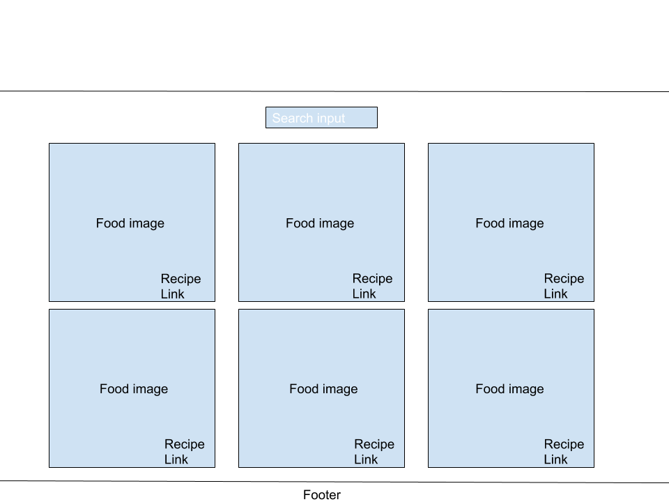

# cookcipe
### Description
Cookcipe is an app built with React and an API. It's for foodie and cooking enthusiast.

### [App link](https://cookcipe.herokuapp.com/)


### Wireframe



### React Component Hierarchy
* App > Header > Logo
* App > Search > Recipes > Recipe
* App > Footer
* App > Router

### State Components
App, Recipes, Recipe

### Funcitonal Components
Header, Logo, Router, Footer


### Code Snippet
A very important react lifecycle method

```
componentDidMount(){
  this.getRecipe()
}


